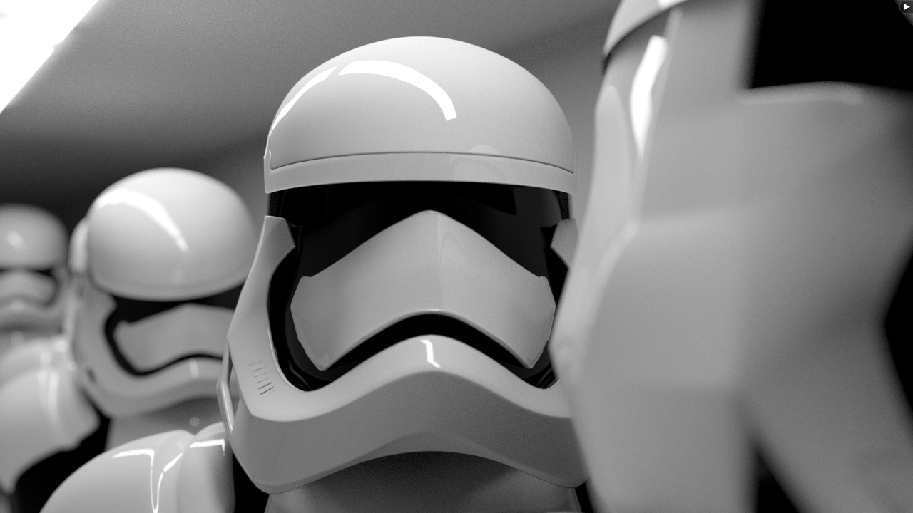
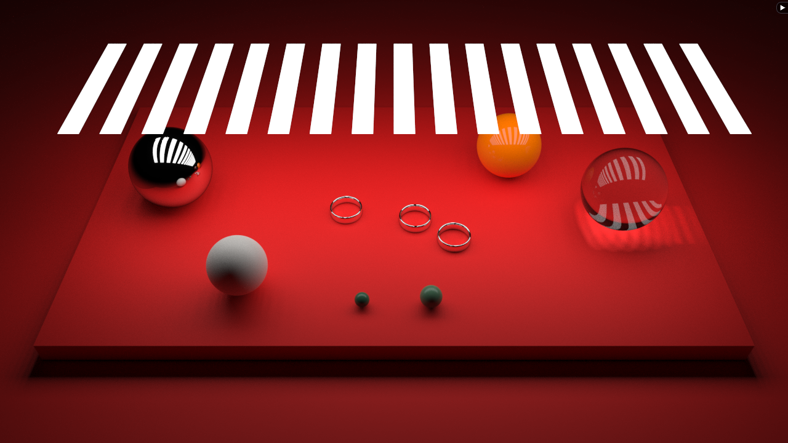
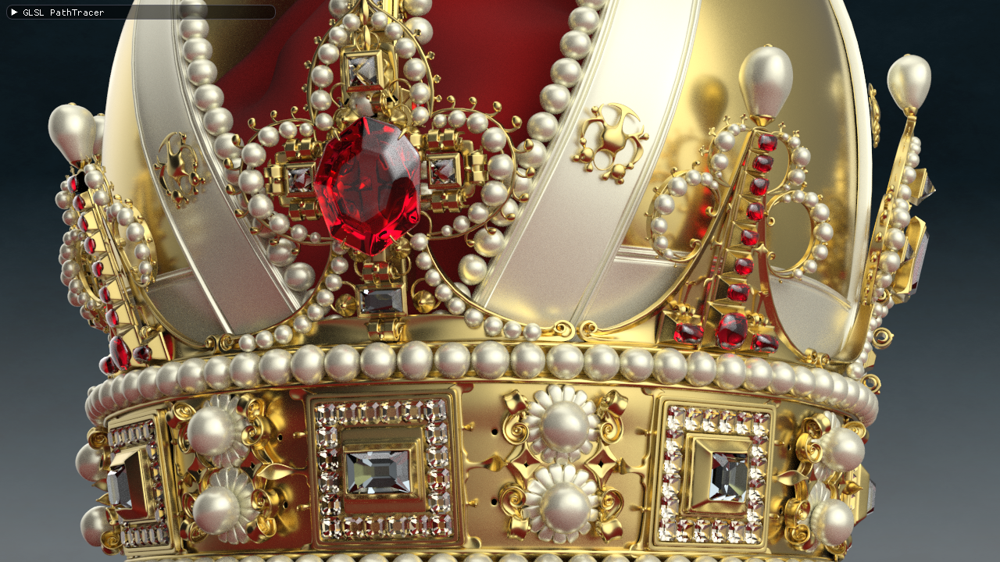
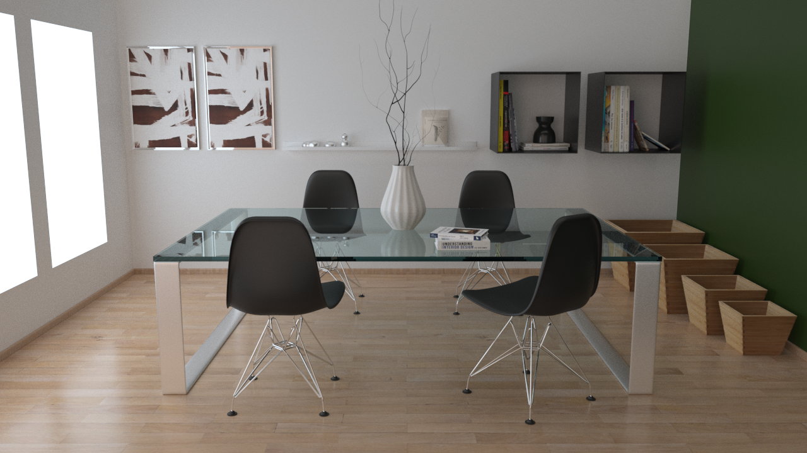
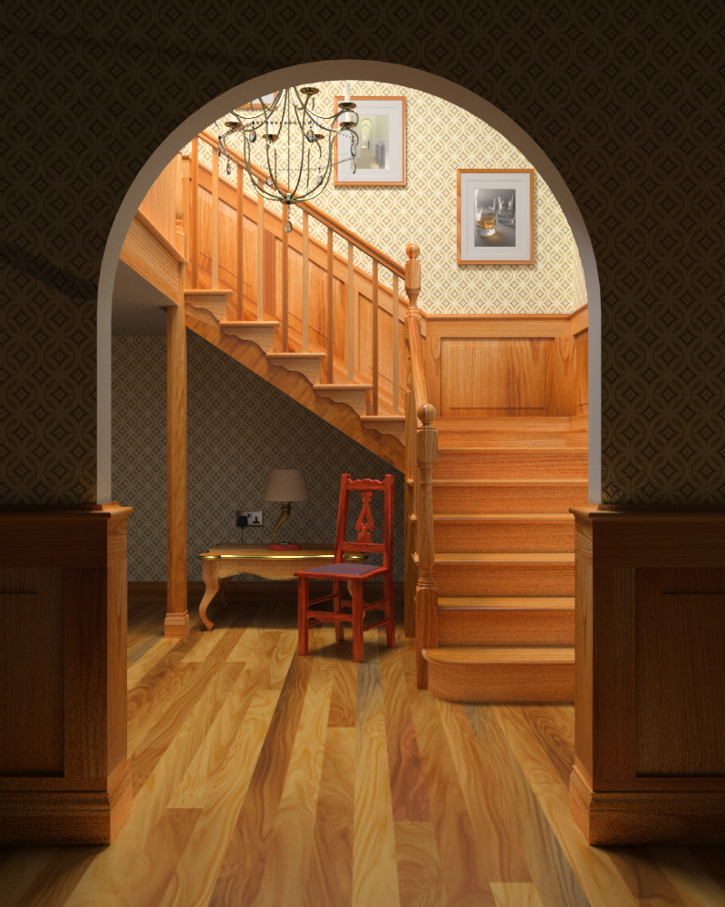

GLSL-PathTracer
==========
A physically based Path Tracer that runs in a GLSL Fragment shader.

Recreation of a scene from [Greyscalegorilla](https://twitter.com/GSG3D). Render time: 2 minutes on a GTX 750 Ti. 3 bounces

Features
--------
- Unidirectional PathTracer
- RadeonRays for building BVHs (Traversal is performed in a shader)
- Metallic-Roughness Material Model
- Texture Mapping (Albedo, Metallic, Roughness, Normal maps)
- Spherical and Rectangular Area Lights
- IBL with importance sampling
- Progressive + Tiled Rendering (Reduces GPU usage and timeout when depth/scene complexity is high)

Build Instructions
--------
Please see INSTALL-WIN.txt for the build instructions

Sample Scenes
--------
A couple of sample scenes are provided in the repository. Additional scenes can be downloaded from here:
https://drive.google.com/file/d/1UFMMoVb5uB7WIvCeHOfQ2dCQSxNMXluB/view

TODO
--------
- ~~IBL importance sampling~~
- ~~Emissive geometry~~
- ~~Two-level BVH for instances and transforms~~
- Support for different texture sizes
- Performance improvements
- Support for rendering out animation sequences

Additional Screenshots
--------

--------

--------

--------

--------

--------

--------

References/Credits
--------
- A huge shout-out to Cedric Guillemet (https://github.com/CedricGuillemet) for cleaning up the code, adding the UI, integrating ImGuizmo, cmake and quite a lot of fixes.
- Ray Tracing in One Weekend (https://github.com/petershirley/raytracinginoneweekend) Peter Shirley's excellent book introductory book on raytracing which helped me get started on this project
- Mitsuba Renderer (https://github.com/mitsuba-renderer/mitsuba) Main reference for validation of the code.
- Tinsel Renderer (https://github.com/mmacklin/tinsel) A really amazing renderer which has several features. A modified version of the scene description & loader are taken from here. Reference for MIS, light sampling
- Sam Lapere's path tracing tutorial ((https://github.com/straaljager/GPU-path-tracing-tutorial-4) Source for the Nvidia's SBVH used here. Traversal isn't the same as this code though. No Woop triangles either
- Erich Loftis's THREE.js PathTracer (https://github.com/erichlof/THREE.js-PathTracing-Renderer) Several amazing webgl examples including bidirectional path tracing all running in a web browser.
- Optix Advanced Samples, especially OptiX Introduction Samples (https://github.com/nvpro-samples/optix_advanced_samples/tree/master/src/optixIntroduction) Source for several tutorials
