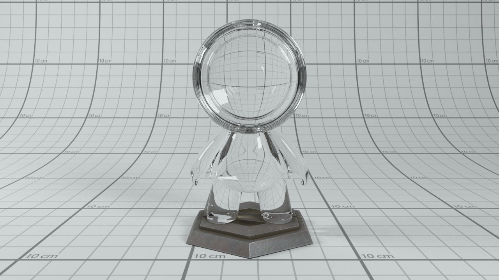

GLSL-PathTracer
==========

[Rank 3 Police Unit](https://nikvili.artstation.com/projects/xggaR)
Scene by Nika Zautashvili. Make sure you check out his ArtStation page (https://nikvili.artstation.com/) since this render doesn't do justice to the original.
He has put up this amazing blender scene for free and it was immensely useful for me in evaluating this renderer :) The one used here is a slightly simplified version
from [SketchFab](https://sketchfab.com/models/d7698f6a7acf49c68ff0a50c5a1b1d52) since I barely had any GPU memory left on my poor GTX 750ti. Render is color corrected

--------

--------

A physically based Path Tracer that runs in a GLSL Fragment shader.

Features
--------
- Unidirectional PathTracer
- Nvidia's SBVH (BVH with Spatial Splits)
- UE4 Material Model
- Texture Mapping (Albedo, Metallic, Roughness, Normal maps). All Texture maps are packed into 3D textures
- Spherical and Rectangular Area Lights
- Progressive Renderer
- Tiled Renderer (Reduces GPU usage and timeout when depth/scene complexity is high)

Build Instructions
--------
Open the visual studio project (I'm using VS Community 2017) and set the configuration to 'Release' and x64 and rebuild the solution. The configuration of the renderer/sample counts/depth is moved to the scene file.
The scene files are in the assets folder

TODO
--------
- ~~Actually use the normal maps (Right now they are just loaded and sent to the GPU but not used)~~
- ~~Move renderer configuration to scene file~~
- ~~IBL~~
- ~~Emissive geometry~~
- Fix issues with normal map
- IBL importance sampling
- Emissive mesh sampling
- Sun Sky Model 
- Nested dielectrics

Additional Screenshots
--------

--------

--------

References/Credits
--------
The following links/projects/books were really useful to me
- Ray Tracing in One Weekend (https://github.com/petershirley/raytracinginoneweekend) Peter Shirley's excellent book introductory book on raytracing which helped me get started on this project
- Mitsuba Renderer (https://github.com/mitsuba-renderer/mitsuba) Main reference for validation of the code. 
- Tinsel Renderer (https://github.com/mmacklin/tinsel) A really amazing renderer which has several features. A modified version of the scene description & loader are taken from here. Reference for MIS, light sampling
- Sam Lapere's path tracing tutorial ((https://github.com/straaljager/GPU-path-tracing-tutorial-4) Source for the Nvidia's SBVH used here. Traversal isn't the same as this code though. No Woop triangles either
- Erich Loftis's THREE.js PathTracer (https://github.com/erichlof/THREE.js-PathTracing-Renderer) Several examples that I got to learn from
- Optix Advanced Samples, especially OptiX Introduction Samples (https://github.com/nvpro-samples/optix_advanced_samples/tree/master/src/optixIntroduction) Source for several tutorials

There's only so much that can be done in a fragment shader before you end up with convoluted code or no performance gains. Will probably have to start with the bible 'PBRT' eventually and end up learning CUDA later. 
But for now this is a fun learning experience to see what can be done in a single shader :)