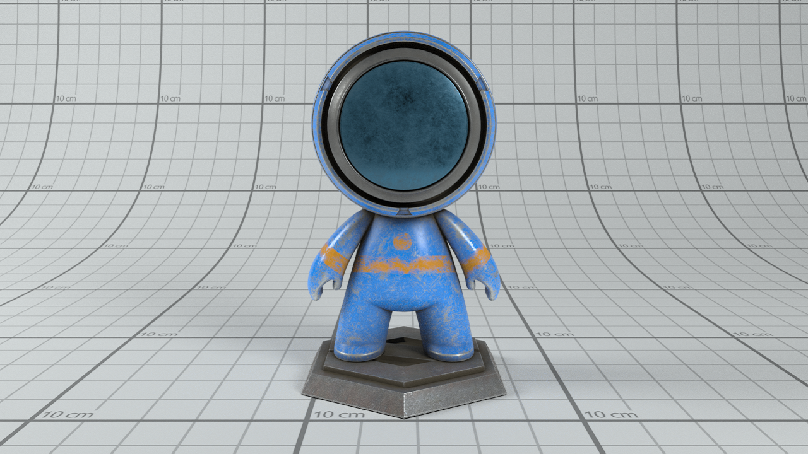

GLSL-PathTracer
==========

--------

--------

A physically based Path Tracer that runs in a GLSL Fragment shader

Features
--------
- Unidirectional PathTracer
- Nvidia's SBVH (BVH with Spatial Splits)
- UE4 Material Model
- Texture Mapping (Albedo, Metallic, Roughness, Normal maps). All Textures maps are packed into 3D textures
- Spherical and Rectangular Area Lights
- Progressive Renderer
- Tiled Renderer (Reduces GPU usage and timeout when depth/scene complexity is high)

TODO
--------
- IBL

Additional Screenshots
--------

--------

--------

References/Credits
--------
The following links/projects/books were really useful to me
- Ray Tracing in One Weekend (https://github.com/petershirley/raytracinginoneweekend) Peter Shirley's excellent book introductory book on raytracing which helped me get started on this project
- Tinsel Renderer (https://github.com/mmacklin/tinsel) A really amazing renderer which several features. A modified version of the scene description & loader are taken from here
- Sam Lapere's path tracing tutorial ((https://github.com/straaljager/GPU-path-tracing-tutorial-4) Source for the Nvidia's SBVH used here. Traversal isn't the same as the code here though. No Woop triangles either
- Erich Loftis's THREE.js PathTracer (https://github.com/erichlof/THREE.js-PathTracing-Renderer) Several examples that I got to learn from
