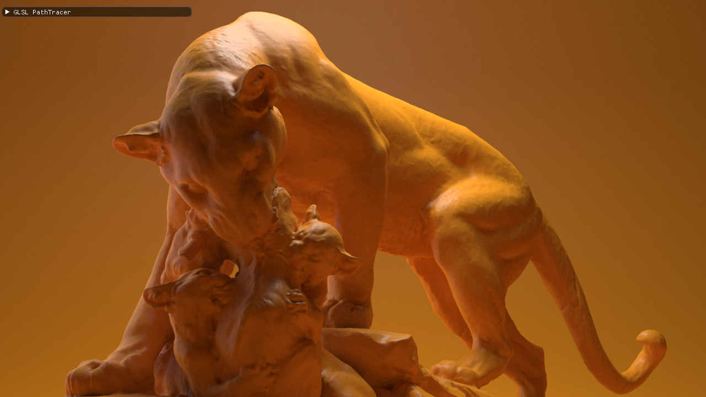
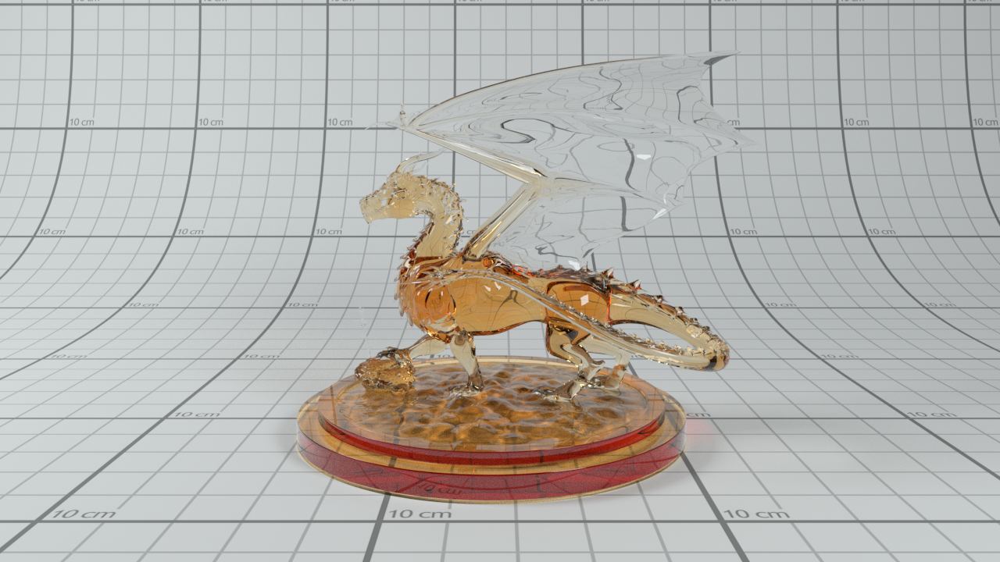
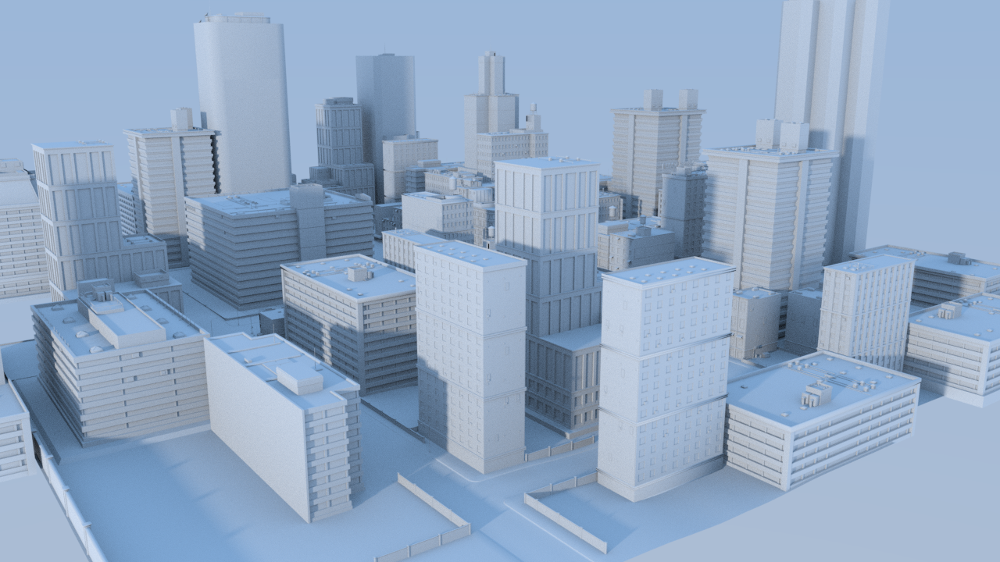

GLSL-PathTracer
==========

[Rank 3 Police Unit](https://nikvili.artstation.com/projects/xggaR)
Scene by Nika Zautashvili. (https://nikvili.artstation.com/) The one used here is a slightly simplified version from [SketchFab](https://sketchfab.com/models/d7698f6a7acf49c68ff0a50c5a1b1d52) 

Recreation of a scene from [Greyscalegorilla](https://twitter.com/GSG3D). Render time: 2 minutes on a GTX 750 Ti. 3 bounces

 
--------

--------

--------

A physically based Path Tracer that runs in a GLSL Fragment shader.

Features
--------
- Unidirectional PathTracer
- RadeonRays for building the BVHs
- UE4 Material Model
- Texture Mapping (Albedo, Metallic, Roughness, Normal maps). All Texture maps are packed into 3D textures
- Spherical and Rectangular Area Lights
- IBL with importance sampling
- Progressive Renderer
- Tiled Renderer (Reduces GPU usage and timeout when depth/scene complexity is high)

Build Instructions
--------
Please see INSTALL-WIN.txt for the build instructions

TODO
--------
- ~~Actually use the normal maps (Right now they are just loaded and sent to the GPU but not used)~~
- ~~Move renderer configuration to scene file~~
- ~~IBL~~
- ~~Emissive geometry~~
- ~~IBL importance sampling~~
- ~~Two-level BVH for instances and transforms
- Support to render out animation sequences
- Displacement mapping
- Emissive mesh sampling
- Sun Sky Model 
- Nested dielectrics
- Fix issues with normal map (Microfacet-based normal mapping?)

Additional Screenshots
--------

--------

--------

--------

References/Credits
--------
- A huge shout-out to Cedric Guillemet (https://github.com/CedricGuillemet) for cleaning up the code, adding the UI, integrating ImGuizmo, cmake and quite a lot of fixes. 
- Ray Tracing in One Weekend (https://github.com/petershirley/raytracinginoneweekend) Peter Shirley's excellent book introductory book on raytracing which helped me get started on this project
- Mitsuba Renderer (https://github.com/mitsuba-renderer/mitsuba) Main reference for validation of the code. 
- Tinsel Renderer (https://github.com/mmacklin/tinsel) A really amazing renderer which has several features. A modified version of the scene description & loader are taken from here. Reference for MIS, light sampling
- Sam Lapere's path tracing tutorial ((https://github.com/straaljager/GPU-path-tracing-tutorial-4) Source for the Nvidia's SBVH used here. Traversal isn't the same as this code though. No Woop triangles either
- Erich Loftis's THREE.js PathTracer (https://github.com/erichlof/THREE.js-PathTracing-Renderer) Several amazing webgl examples including bidirectional path tracing all running in a web browser.
- Optix Advanced Samples, especially OptiX Introduction Samples (https://github.com/nvpro-samples/optix_advanced_samples/tree/master/src/optixIntroduction) Source for several tutorials
